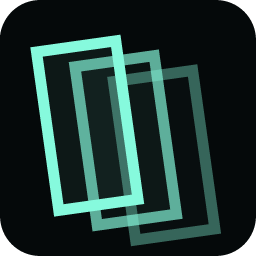

# FSN: 3D File System Navigator

A web and desktop tribute to SGI's File System Navigator. It renders one directory at a time as a deterministic WebGL city. The web app is read-only; the Tauri desktop app can edit UTF-8 text and open files in their native application.

## Run locally

```sh
pnpm install
pnpm dev:web
```

Then open the local URL printed by Vite.

To run the native app, install the [Tauri prerequisites](https://v2.tauri.app/start/prerequisites/) for your operating system, then run:

```sh
pnpm dev:desktop
```

## Workspace architecture

FSN is a pnpm workspace with two deliberately separate application shells:

| Workspace | Responsibility |
| --- | --- |
| `apps/web` | Browser filesystem adapter, remembered browser handles, Vercel Analytics, and web metadata. |
| `apps/desktop` | Tauri v2 shell, native filesystem adapter, capabilities, Rust commands, and desktop packaging. |
| `packages/core` | Platform-neutral filesystem model, classification, search, formatting, and parsers. |
| `packages/app` | Shared navigator controller, WebGL scene, viewers, styles, shell markup, and demo assets. |

[Turborepo](https://turborepo.com/docs) orchestrates and caches workspace tasks. Turbopack is intentionally not used here: it is the Next.js bundler, while FSN is a Vite application and [Tauri supports Vite directly](https://v2.tauri.app/start/frontend/vite/). This keeps web and desktop isolated without migrating the working app to Next.js.

## Controls

- Drag to orbit; right-drag to pan; scroll to move through the world.
- Use `W`, `A`, `S`, `D` or the arrow keys to move.
- Click an object to inspect it; double-click a directory to enter it.
- Press `Backspace` to return to the parent.
- In the browser, back and forward retrace the directories you entered, and the address bar names the one you are in, so a reload returns to it.
- Press `/` or `Cmd/Ctrl + K` to search the current directory.
- Open objects in old-school viewer windows. Unknown or executable objects produce an access-denied screen, with a `FORCE HEX DUMP` override.

## The address

The directory you are in is written into the location fragment — `#/Macintosh HD/Documents/Field Notes` — so entering one is a history entry, back and forward walk the directories you walked, and a reload lands where you left off. A restored address is walked one level at a time, reading each, since a fresh tab has read nothing below the root; an address naming a directory that has since gone lands as deep as it still can and corrects itself.

It is a fragment rather than a path because that is what it honestly is: a place inside the one page there has ever been, not a resource a server could return. Nothing has to be rewritten to serve it — not on the host, not in the Tauri asset protocol — and there remains a single canonical URL.

The names are relative to whichever source is mounted, so an address is not a link anyone else can follow: it means something only alongside the folder this browser has already been granted. When a remembered folder comes back needing a click to re-grant it, the address is left naming that folder until it is mounted, so reloading again still restores the same place.

## Object viewers

Each viewer is loaded on demand, so a session only downloads the readers it uses.

| Object | Viewer |
| --- | --- |
| UTF-8 text, source, Markdown/MDX, YAML, config, templates, logs | SimpleText pane with line numbers. Extensionless files (`Makefile`, `LICENSE`, known lockfiles, dotfiles) are recognised by name. |
| Images | Canvas viewer with a real resampling pixel filter. Animated GIF/APNG/WebP are decoded frame by frame so the filter does not freeze them. |
| 3D models (`.stl`, `.obj`, `.ply`, `.glb`, `.gltf`) | Orbitable mesh inspector with wireframe and spin toggles. |
| Audio and video | Player with custom transport controls and switchable visualizers (see below). |
| `.csv` / `.tsv` | Record sheet with a quoted-field reader and separator detection. |
| `.json` | Collapsible tree with a raw-source toggle. |
| `.zip` / `.jar` | Archive manifest read from the central directory. Nothing is extracted or executed. |
| Fonts (`.ttf`, `.otf`, `.woff`, `.woff2`) | Specimen sheet at a range of sizes. |
| `.pdf` | Embedded document reader. |
| Anything else | Access-denied screen, with an optional hex dump of the first 64 KB. |

## The sound player

The browser's own media controls are switched off; the deck draws its own transport
(play/pause, stop, seek, volume), which is keyboard operable — `Space` toggles play,
arrows scrub, `Shift` + arrows scrub further.

Playback starts on open where the browser permits it. Opening the object is itself a
gesture, so it usually does; when it refuses, the deck waits and says so rather than
falling back to muted autoplay, which would look like it was playing while producing
silence.

Audio opens onto one of three visualizers, all fed from a single `AnalyserNode`:

- **GRID** — a synthwave landscape, driven by two separate things.

  The spectrum is written one row at a time at the horizon into a scrolling height
  texture, and travels toward you: the slow landscape. On its own it cannot feel like
  the music, because at this road length and speed a ridge takes about seven seconds
  to arrive. So each detected onset also fires a **shockwave** that crosses the whole
  road in roughly four tenths of a second — that is what actually reads as being on
  the beat, alongside the flash, the sun flare and the camera kick.

  The grid is real geometry: line segments between neighbouring vertices of the
  displaced lattice, not a `fract()` pattern painted onto a plane. The painted version
  only agrees with the surface when the cell size happens to match the vertex spacing;
  otherwise the lines float free and every ridge tears along a seam.
- **BARS** — log-spaced spectrum with peak caps and a reflection.
- **SCOPE** — oscilloscope with phosphor persistence.

Video keeps the picture and gets a slim spectrum strip beneath it. Pausing lets the
world settle, and `prefers-reduced-motion` slows the travel and drops the beat-driven
camera kick. Seeking reseeds the terrain from the new position rather than zeroing it,
since a buffer of silence meeting live audio puts a vertical cliff across the road.

## Local files and privacy

The **Open folder** control uses the File System Access API where available. Other browsers fall back to a `webkitdirectory` directory snapshot. Neither mode uploads filenames, metadata, or file contents; all rendering and previewing happens in the browser. The application never writes to selected files.

The address holds directory names from the folder you opened. A fragment is never sent with a request, but analytics reports whatever `location.href` says, so a `beforeSend` hook cuts the fragment off every event before it is sent. There is one page and every address is a view of it, so the measurement loses nothing.

The desktop app asks Tauri for access only to a directory selected through the native picker. A Rust-owned active-root capability validates every native filesystem command; choosing another folder or returning to the demo revokes the old root. There is no static home-directory or global filesystem scope.

- **Open in native app** passes the selected file to a Rust command that canonicalizes it, verifies it is an allowed regular file, and only then opens it.
- **Text editing** accepts valid UTF-8 files, preserves BOM and line endings, saves only after an explicit click, warns about unsaved changes, checks content/identity snapshots immediately before saving, and uses atomic replacement to avoid partial writes.
- Demo objects remain read-only and never receive native actions.

## Verification

```sh
pnpm check
```

That runs all TypeScript checks, tests, and both Vite webview builds. Verify the Rust application separately with:

```sh
cargo fmt --check --manifest-path apps/desktop/src-tauri/Cargo.toml
cargo check --locked --manifest-path apps/desktop/src-tauri/Cargo.toml
```

Create a local desktop bundle for the current operating system with:

```sh
pnpm build:desktop
```

Push a version tag matching `apps/desktop/package.json` to create an unsigned Apple Silicon draft prerelease:

```sh
pnpm validate:desktop-release v0.1.0
git tag -a v0.1.0 -m "FSN desktop v0.1.0"
git push origin v0.1.0
```

The release workflow verifies the workspace and Rust backend before uploading the app and DMG. Signing and notarization remain separate release steps. The shared demo model is generated; regenerate it with:

```sh
node packages/app/tools/make-demo-model.mjs
```

## Credits

The demo filesystem plays **"Vice"** from *White Bat XVII*.

> Music by Karl Casey @ White Bat Audio: <https://karlcasey.bandcamp.com/album/white-bat-xvii>

The credit travels with the file: it is shown in the sound player whenever the track is opened, and repeated in `Music/credits.txt` inside the demo filesystem.
